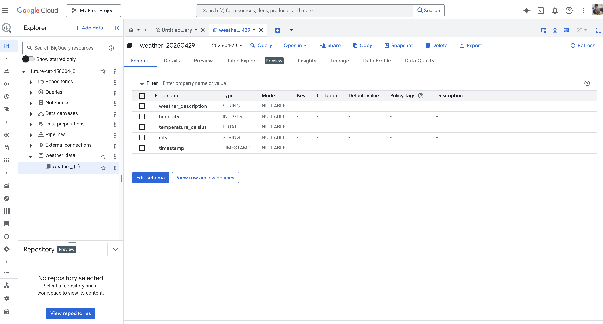
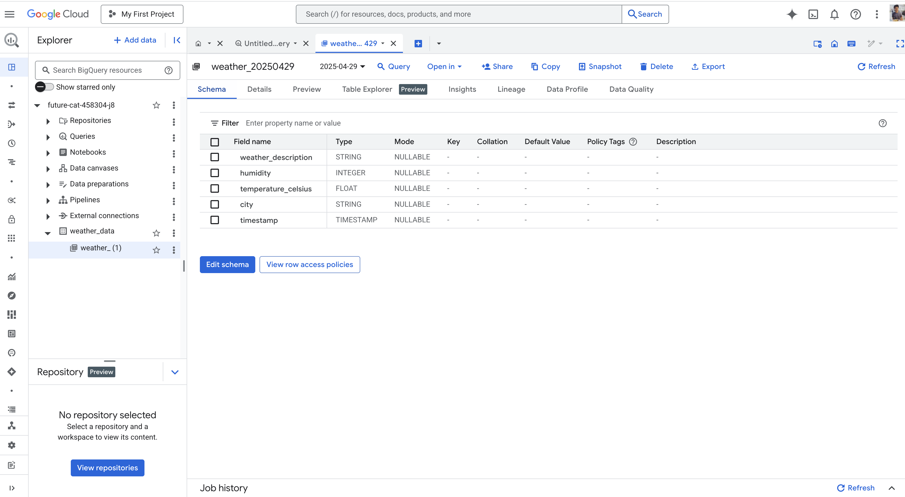

# OpenWeather Data Pipeline

## 📖 Overview
This project demonstrates a simple end-to-end data pipeline that:

1. Fetches real-time weather data from the OpenWeather API  
2. Cleans and transforms the JSON payload using Pandas  
3. Writes newline-delimited JSON to Google Cloud Storage (GCS)  
4. Loads the processed data back into BigQuery  
5. Performs basic analytical queries in BigQuery and Pandas  

<!-- 2×2 이미지 그리드 -->
| Figure 1. Project 3 – Graph View | Figure 2. Project 3 – Calendar View |
|:--:|:--:|
| <br><em>Graph view of DAG dependencies</em> | <br><em>Calendar view of scheduled runs</em> |

| Figure 3. Project 1 – End-to-End Architecture | Figure 4. Project 1 – BigQuery Table Schema |
|:--:|:--:|
| <br><em>Pipeline architecture diagram</em> | <br><em>Loaded table schema in BigQuery</em> |

</div>
**Tech Stack:**  
- **Language:** Python 3.9+  
- **Data Processing:** Pandas  
- **Cloud Storage:** Google Cloud Storage  
- **Data Warehouse:** BigQuery  
- **APIs:** OpenWeather API, Google Cloud APIs  

---

## Project Structure
```text
openweather-data-pipeline/
├── data/
│   ├── raw/                          # Raw OpenWeather JSON files
│   └── processed/                    # Cleaned, newline-delimited JSON
├── scripts/
│   ├── fetch_weather_data.py         # 1. Fetch & save raw JSON
│   ├── transform_weather_data.py     # 2. Clean & convert to newline-delimited JSON
│   ├── upload_to_gcs.py              # 3. Upload JSON to GCS
│   ├── analyze_weather_data.py       # 4. Local Pandas analysis
│   ├── load_data_to_bigquery.py      # 5. Load JSON from GCS into BigQuery
│   └── query_bigquery_data.py        # 6. Run SQL queries in BigQuery
├── requirements.txt                  # Python dependencies
└── README.md                         # This file
```
---

## Prerequisites

1. **Python 3.9+** and virtual environment  
2. **OpenWeather API key** (free tier)  
3. **Google Cloud project** with:
   - Google Cloud Storage API enabled  
   - BigQuery API enabled  

### Install dependencies

```bash
python -m venv .venv
source .venv/bin/activate
pip install -r requirements.txt

export OPENWEATHER_API_KEY="YOUR_OPENWEATHER_API_KEY"
export GOOGLE_APPLICATION_CREDENTIALS="/path/to/your/gcp-service-account-key.json"
export GCP_PROJECT_ID="your-gcp-project-id"
export GCS_BUCKET="your-gcs-bucket-name"

How to Run
1.	Fetch & Save Raw JSON - python scripts/fetch_weather_data.py
	•	Fetches current weather for a hard-coded city (e.g. Toronto)
	•	Saves to data/raw/weather_<YYYYMMDD>.json
2.	Transform & Clean Data - python scripts/transform_weather_data.py
  •	Loads the raw JSON
	•	Fills missing values, converts timestamps, normalizes text
	•	Outputs newline-delimited JSON to data/processed/processed_weather_<YYYYMMDD>_ld.json
3.	Upload to Google Cloud Storage - python scripts/upload_to_gcs.py
	•	Uploads the processed JSON to gs://$GCS_BUCKET/weather_data/
4.	Analyze Locally with Pandas - python scripts/analyze_weather_data.py
  •	Performs GroupBy, Filtering, Sorting, and simple aggregations
5.	Load into BigQuery - python scripts/load_data_to_bigquery.py
  •	Loads newline-delimited JSON from GCS into BigQuery table weather_data.weather_<YYYYMMDD>
6.	Run SQL Queries in BigQuery - python scripts/query_bigquery_data.py
  •	Executes a sample query: daily average temperature for the past week

 Example Output
**Local Pandas Analysis**
=== Average/Maximum/Minimum Temperatures by Weather ===
  weather_description   mean    max    min
0           clear sky  10.36  10.36  10.36

=== Only Clear and Warm Days ===
Empty DataFrame
Columns: [timestamp, city, temperature_celsius, humidity, weather_description]
Index: []

=== High/Low Temperature Classification ===
   temperature_celsius temp_category
0                10.36           low

=== Average Humidity by High/Low Temperature ===
  temp_category  humidity
0           low      57.0

**BigQuery Query**
=== Daily Average Temperatures for the Last 7 Days ===
2025-04-29: 10.36°C over 1 records

 **License**
This project is licensed under the MIT License.
See LICENSE for details.
